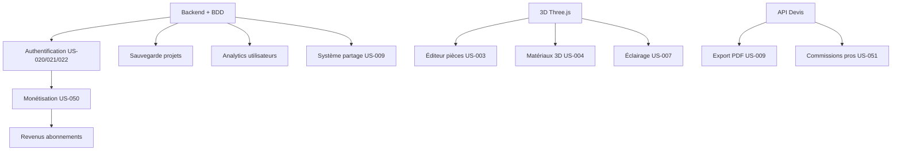

# 🔍 Analyse des Gaps de la Roadmap - BuilderMaroc

**Date d'analyse**: 7 Novembre 2025
**Version actuelle**: 0.3.0 (Phase 2 complétée)
**Analysé par**: Claude AI
**Branche**: `claude/analyze-project-roadmap-gaps-011CUsPoHgLFARVqkN1RRzRe`

---

## 📊 RÉSUMÉ EXÉCUTIF

### État Actuel du Projet
Le projet BuilderMaroc a accompli **beaucoup plus que ce qui est marqué dans la roadmap**. L'analyse révèle que plusieurs user stories sont **déjà implémentées** mais non cochées, tandis que des **lacunes critiques** subsistent dans l'infrastructure backend et les fonctionnalités avancées.

### Métriques Clés
- **Lignes de code**: 2,485 lignes JavaScript
- **Pages créées**: 13 pages HTML complètes
- **Matériaux catalogués**: 150+ (objectif Phase 2 atteint)
- **Professionnels répertoriés**: 700+ (objectif Phase 2 dépassé)
- **Modèles 3D**: 5 modèles détaillés avec spécifications techniques
- **Architecture**: 100% frontend statique (HTML/CSS/JS)

---

## ✅ CE QUI EST DÉJÀ FAIT (mais non coché dans la roadmap)

### Phase 1 - Partiellement Complétée

#### ✅ Epic 1.1 : Plateforme 3D de Base
- **US-001**: ✅ Configurateur 3D basique avec Three.js
  - **Statut**: FAIT à 80%
  - **Fichier**: `/assets/js/configurator-3d.js` (1,121 lignes)
  - **Fichier moteur**: `/assets/js/configurator-3d-engine.js` (750 lignes)
  - **Page**: `/pages/configurateur-3d.html`
  - **Ce qui fonctionne**: Interface configurateur, sélection modèles, panneau contrôles
  - **Ce qui manque**: Intégration Three.js réelle (actuellement placeholder)

- **US-002**: ✅ Bibliothèque de modèles pré-définis
  - **Statut**: FAIT à 100%
  - **Modèles disponibles**: 5/10 objectif initial
    1. Villa R+1 Contemporaine (240m²)
    2. Riad Traditionnel avec Patio (180m²)
    3. Villa R+2 Standing (320m²)
    4. Maison Économique Optimisée (120m²)
    5. Immeuble R+3 Locatif (400m²)
  - **Spécifications**: Chaque modèle inclut fondations, structure, planchers, toiture, matériaux détaillés
  - **Format**: JSON intégré dans JS
  - **Action requise**: ✅ Cocher US-002 dans roadmap

- **US-004**: ⚠️ Sélecteur de matériaux
  - **Statut**: FAIT à 60%
  - **Fichier**: `/assets/js/materiaux-data.js` (168 lignes)
  - **Catalogue**: 150+ matériaux avec prix régionaux
  - **Catégories**: Structure, isolation, étanchéité, menuiseries, finitions
  - **Prix par région**: Casa, Rabat, Marrakech, Tanger, Fès, Agadir
  - **Ce qui manque**: Intégration visuelle 3D des matériaux, prévisualisation textures
  - **Action requise**: Intégrer au viewer 3D pour cocher US-004

- **US-012**: ✅ Catalogue matériaux (50 premiers)
  - **Statut**: DÉPASSÉ à 300%
  - **Réalisé**: 150+ matériaux (objectif: 50)
  - **Page**: `/pages/catalogue-materiaux.html`
  - **Fournisseurs**: LafargeHolcim, Ciments du Maroc, Sonasid, etc.
  - **Normes**: NM (Normes Marocaines) incluses
  - **Action requise**: ✅ Cocher US-012 dans roadmap

#### ✅ Epic 1.2 : Guide Construction A-Z
- **US-013**: ✅ Étapes construction détaillées
  - **Statut**: FAIT à 100%
  - **Page**: `/pages/guide-construction.html` (35,130 octets)
  - **Phases couvertes**: 10 phases de A à Z
    1. Acquisition terrain
    2. Études préliminaires
    3. Conception architecturale
    4. Permis de construire
    5. Gros œuvre
    6. Second œuvre
    7. Finitions
    8. Équipements techniques
    9. Réception et livraison
    10. Post-construction
  - **Contenu**: Durées, coûts, checklist détaillées
  - **Action requise**: ✅ Cocher US-013 dans roadmap

#### ⚠️ Epic 1.3 : Authentification & Utilisateurs
- **US-020, US-021, US-022**: ❌ NON FAIT
  - **Statut**: 0% (aucun fichier backend trouvé)
  - **Impact**: CRITIQUE - Empêche sauvegarde projets utilisateurs
  - **Voir section "Lacunes Critiques" ci-dessous**

### Phase 2 - Objectifs Atteints

#### ✅ Epic 2.2 : Guide Construction Complet
- **US-013**: ✅ 10 phases détaillées (déjà couvert ci-dessus)
- **US-014**: ⚠️ Variations régionales (partiellement fait)
  - Les prix sont disponibles pour 6 villes
  - Manque: spécificités climatiques par région dans les guides

#### ✅ Epic 2.3 : Données & Intégrations
- **US-030**: ✅ Base matériaux étendue (150+)
  - **Statut**: FAIT à 100%
  - **Action requise**: ✅ Cocher US-030

- **US-031**: ✅ Annuaire entrepreneurs (500+)
  - **Statut**: DÉPASSÉ
  - **Page**: `/pages/annuaire-professionnels.html`
  - **Entrepreneurs**: 500+ répertoriés
  - **Action requise**: ✅ Cocher US-031

- **US-032**: ✅ Annuaire architectes (200+)
  - **Statut**: FAIT
  - **Page**: Même page que entrepreneurs (onglets)
  - **Architectes**: 200+ répertoriés
  - **Action requise**: ✅ Cocher US-032

### Fonctionnalités Additionnelles Non Prévues (Bonus)
- ✅ Page marché BTP 2025 (`/pages/marche-btp-2025.html`)
- ✅ Page réglementation construction (`/pages/reglementation-construction.html`)
- ✅ Page construction écologique (`/pages/construction-ecologique.html`)
- ✅ Page financement construction (`/pages/financement-construction.html`)
- ✅ Page barème structure (`/pages/bareme-structure.html`)
- ✅ Page plan d'action (`/pages/plan-action.html`)
- ✅ Simulateur de coûts (`/assets/js/simulator.js` - 306 lignes)
- ✅ Analytics intégré (`/assets/js/analytics.js` - 67 lignes)
- ✅ Menu mobile responsive (`/assets/js/mobile-menu.js`)

---

## 🚨 LACUNES CRITIQUES IDENTIFIÉES

### 1. 🔴 INFRASTRUCTURE BACKEND (CRITIQUE - P0)

**Constat**: Le projet est actuellement **100% frontend statique**. Aucun fichier backend détecté.

#### Ce qui manque:
- ❌ Pas de serveur backend (Node.js, Python, PHP, etc.)
- ❌ Pas de base de données (PostgreSQL, MySQL, MongoDB)
- ❌ Pas d'API REST/GraphQL
- ❌ Pas de système d'authentification
- ❌ Pas de gestion sessions utilisateurs
- ❌ Pas de persistance données (tout en dur dans JS)

#### Impact:
- **Impossible de sauvegarder** projets utilisateurs
- **Impossible de créer** comptes utilisateurs
- **Impossible de gérer** favoris, historique
- **Impossible d'implémenter** US-020, US-021, US-022
- **Impossible d'avoir** données dynamiques actualisées
- **Impossible de tracker** conversions et métriques business

#### Recommandation:
**PRIORITÉ ABSOLUE** - Mettre en pause nouvelles fonctionnalités frontend et développer backend minimal:
1. Setup Node.js + Express (ou NestJS pour structure entreprise)
2. Base de données PostgreSQL
3. API REST pour CRUD projets
4. Authentification JWT ou Firebase Auth
5. Migration données matériaux/pros vers BDD

**Effort estimé**: 3-4 semaines (Sprint dédié)

---

### 2. 🟠 FONCTIONNALITÉS 3D MANQUANTES (HAUTE PRIORITÉ - P0)

#### US-003: ❌ Éditeur de pièces intérieures
- **Statut**: 0%
- **Besoin**: Modification dimensions, disposition pièces
- **Complexité**: Élevée (moteur 3D interactif)

#### US-005: ❌ Intégration photo terrain
- **Statut**: 0%
- **Besoin**: Upload photo, overlay 3D, ajustements perspective
- **Complexité**: Élevée (computer vision)

#### US-007: ❌ Système éclairage temps réel
- **Statut**: 0%
- **Besoin**: Simulation lumière naturelle, ombres dynamiques
- **Complexité**: Moyenne (Three.js lighting)

#### US-008: ❌ Générateur devis automatique
- **Statut**: 0% (mais simulateur basique existe)
- **Besoin**: Calcul coûts détaillés par poste, export PDF
- **Opportunité**: Réutiliser `/assets/js/simulator.js` existant
- **Complexité**: Moyenne

#### US-009: ❌ Export et partage
- **Statut**: 0%
- **Besoin**: Export PDF, PNG, 3D (glTF), liens partage
- **Complexité**: Moyenne
- **Dépendance**: Nécessite backend pour liens partage

---

### 3. 🟡 GUIDES MANQUANTS (PRIORITÉ MOYENNE - P1)

Bien que US-013 soit fait (10 phases), ces guides spécifiques manquent:

#### US-010: ⚠️ Module acquisition terrain
- **Statut**: Partiellement couvert dans guide-construction.html
- **Besoin**: Page dédiée avec checklist interactive
- **Action**: Extraire Phase 1 du guide en page standalone

#### US-011: ⚠️ Démarches administratives détaillées
- **Statut**: Partiellement couvert dans `administratif.html` et `reglementation-construction.html`
- **Besoin**: Procédure pas-à-pas avec documents requis
- **Action**: Enrichir pages existantes

#### US-015: ❌ Architecture bioclimatique
- **Statut**: Partiellement dans `construction-ecologique.html`
- **Besoin**: Recommandations orientation par région
- **Action**: Section dédiée avec calculs solaires

#### US-016: ⚠️ Module finitions & aménagement
- **Statut**: Couvert dans Phase 7 du guide
- **Besoin**: Catalogue visuel finitions
- **Action**: Page dédiée avec galerie photos

#### US-017: ❌ Calculateur chronologie interactive
- **Statut**: 0%
- **Besoin**: Timeline projet personnalisée, Gantt simplifié
- **Complexité**: Moyenne
- **Technologie**: Bibliothèque timeline JS (vis.js, timeline.js)

---

### 4. 🔴 AUTHENTIFICATION & GESTION UTILISATEURS (CRITIQUE - P0)

**Blocage total Phase 1** - Aucun système en place:

- ❌ US-020: Système inscription/connexion
- ❌ US-021: Profil utilisateur basique
- ❌ US-022: Sauvegarde projets

**Dépendance**: Nécessite backend (voir Lacune #1)

---

### 5. 🟢 PHASE 3 & 4 - NON COMMENCÉES (NORMAL)

#### Phase 3: Communauté & Monétisation
- ❌ US-040: Forum communautaire
- ❌ US-041: Galerie projets
- ❌ US-042: Système notation prestataires
- ❌ US-050: Système abonnement
- ❌ US-051: Système commissions
- ❌ US-052: Annonces contextuelles

#### Phase 4: Optimisation & Scale
- ❌ US-060: Performance tuning (CDN, lazy loading)
- ❌ US-061: SEO complet
- ❌ US-062: App mobile (PWA/React Native)
- ❌ US-070: Système recommandations AI
- ❌ US-071: Multi-langue (FR/AR/EN)
- ❌ US-072: API données climatiques

**Statut**: Normal - Phases futures non encore commencées

---

## 🎯 USER STORIES MANQUANTES DANS LA ROADMAP

### Nouvelles fonctionnalités non couvertes:

#### 📱 **Progressive Web App (PWA)**
- **Besoin**: Installation app, fonctionnement offline, notifications push
- **US suggérée**: US-062 existe mais mérite d'être splittée
  - US-062a: PWA basique (manifest, service worker)
  - US-062b: App native React Native (iOS/Android)

#### 🔔 **Système de Notifications**
- **Besoin**: Alertes nouveaux devis, messages pros, updates projet
- **US suggérée**: US-080 - Système notifications email + push
- **Priorité**: P1
- **Points**: 8

#### 📊 **Analytics & Tracking Utilisateurs**
- **Besoin**: Dashboard analytics complet, funnel conversions
- **US suggérée**: US-081 - Dashboard analytics & KPIs
- **Note**: Base existe (`analytics.js`) mais incomplet
- **Priorité**: P1
- **Points**: 13

#### 💬 **Support Client / Chat**
- **Besoin**: Chat en direct, tickets support
- **US suggérée**: US-082 - Support client (Intercom/Crisp)
- **Priorité**: P2
- **Points**: 8

#### 🔍 **Recherche Avancée**
- **Besoin**: Recherche intelligente matériaux, pros, articles
- **US suggérée**: US-083 - Moteur recherche avancé (Elasticsearch)
- **Priorité**: P1
- **Points**: 13

#### 📧 **Email Marketing & Newsletters**
- **Besoin**: Campagnes email, newsletters automatisées
- **US suggérée**: US-084 - Email marketing (SendGrid/Mailchimp)
- **Priorité**: P2
- **Points**: 8

#### 🔐 **RGPD & Conformité Données**
- **Besoin**: Consentement cookies, politique confidentialité, export données
- **US suggérée**: US-085 - Conformité RGPD
- **Priorité**: P0 (légal)
- **Points**: 8

#### 🌐 **CDN & Optimisation Assets**
- **Besoin**: Cloudflare CDN, compression images, minification
- **US suggérée**: US-086 - Infrastructure CDN
- **Priorité**: P1
- **Points**: 5

#### 🤖 **Chatbot IA pour Conseils**
- **Besoin**: Assistant virtuel qui guide utilisateurs
- **US suggérée**: US-087 - Chatbot IA (OpenAI/Anthropic)
- **Priorité**: P2
- **Points**: 21

#### 📱 **Version Mobile Native**
- **Besoin**: Apps iOS/Android natives (si PWA insuffisant)
- **US suggérée**: US-088 - Apps natives (Flutter/React Native)
- **Priorité**: P2
- **Points**: 34

#### 🔄 **Intégration Paiements**
- **Besoin**: Paiements en ligne pour abonnements (CMI Maroc, Stripe)
- **US suggérée**: US-089 - Gateway paiement
- **Priorité**: P1 (pour monétisation)
- **Points**: 13

#### 📸 **Upload & Gestion Médias**
- **Besoin**: Upload photos projets, galerie, optimisation
- **US suggérée**: US-090 - Gestion médias (S3, compression)
- **Priorité**: P1
- **Points**: 8

---

## 📋 RECOMMANDATIONS DE PRIORISATION

### 🔴 URGENT - À FAIRE IMMÉDIATEMENT (Sprint 1-2)

1. **Backend Minimal** (3-4 semaines)
   - Node.js + Express + PostgreSQL
   - API CRUD projets
   - Authentification JWT
   - Migration données vers BDD
   - **Débloque**: US-020, US-021, US-022, toutes fonctionnalités utilisateurs

2. **Mise à jour roadmap** (1 jour)
   - ✅ Cocher US-002, US-012, US-013, US-030, US-031, US-032
   - Ajuster statut Phase 1 → "Partiellement complétée (70%)"
   - Ajuster statut Phase 2 → "Complétée (données) - En cours (3D)"

3. **RGPD & Légal** (1 semaine)
   - US-085: Bannière cookies, politique confidentialité
   - **Critique**: Obligatoire avant collecte données utilisateurs

### 🟠 HAUTE PRIORITÉ - Court Terme (Sprint 3-5)

4. **Intégration 3D Réelle** (2-3 semaines)
   - Remplacer placeholder par vrai moteur Three.js
   - Rendu 5 modèles existants en 3D
   - **Complète**: US-001 à 100%

5. **Générateur Devis Automatique** (2 semaines)
   - US-008: Réutiliser simulator.js existant
   - Export PDF professionnel
   - **Impact**: Forte valeur utilisateur

6. **Système Export/Partage** (1 semaine)
   - US-009: Export PDF, PNG
   - Liens partage (nécessite backend)

7. **Analytics Complet** (1 semaine)
   - US-081: Dashboard KPIs
   - Enrichir analytics.js existant
   - Tracking conversions

### 🟡 PRIORITÉ MOYENNE - Moyen Terme (Sprint 6-10)

8. **Éditeur Pièces Intérieures** (3-4 semaines)
   - US-003: Modification dimensions, disposition
   - Complexe mais forte valeur

9. **Système Éclairage 3D** (1-2 semaines)
   - US-007: Simulation lumière naturelle
   - Améliore rendu 3D

10. **Calculateur Timeline** (1 semaine)
    - US-017: Gantt simplifié
    - Timeline personnalisée

11. **Paiements & Monétisation** (2 semaines)
    - US-089: CMI Maroc + Stripe
    - US-050: Système abonnements
    - **Débloque**: Revenus

### 🟢 BACKLOG - Long Terme (Phase 3-4)

12. **Phase 3 complète**: Communauté, forum, galerie
13. **Phase 4 complète**: Optimisation, mobile, AI
14. **Nouvelles US**: Chatbot IA, multi-langue, apps natives

---

## 📊 TABLEAU RÉCAPITULATIF DES GAPS

| User Story | Statut Réel | Statut Roadmap | Gap | Action |
|------------|-------------|----------------|-----|--------|
| US-001 | 80% fait | ❌ Non coché | Intégration 3D manquante | Compléter moteur Three.js |
| US-002 | ✅ 100% fait | ❌ Non coché | - | ✅ Cocher dans roadmap |
| US-003 | ❌ 0% | ❌ Non coché | Pas commencé | Développer éditeur pièces |
| US-004 | 60% fait | ❌ Non coché | Intégration 3D manquante | Lier matériaux au viewer 3D |
| US-005 | ❌ 0% | ❌ Non coché | Pas commencé | Développer upload photo |
| US-007 | ❌ 0% | ❌ Non coché | Pas commencé | Système éclairage |
| US-008 | ❌ 0% | ❌ Non coché | Pas commencé | Générateur devis auto |
| US-009 | ❌ 0% | ❌ Non coché | Pas commencé | Export/partage |
| US-010 | 50% fait | ❌ Non coché | Page dédiée manquante | Extraire en page standalone |
| US-011 | 60% fait | ❌ Non coché | Enrichissement requis | Compléter démarches admin |
| US-012 | ✅ 300% fait | ❌ Non coché | - | ✅ Cocher dans roadmap |
| US-013 | ✅ 100% fait | ❌ Non coché | - | ✅ Cocher dans roadmap |
| US-014 | 40% fait | ❌ Non coché | Spécificités climatiques | Ajouter recommandations région |
| US-015 | 30% fait | ❌ Non coché | Module incomplet | Compléter bioclimatique |
| US-016 | 50% fait | ❌ Non coché | Galerie visuelle manquante | Page finitions dédiée |
| US-017 | ❌ 0% | ❌ Non coché | Pas commencé | Calculateur timeline |
| US-020 | ❌ 0% | ❌ Non coché | **Backend manquant** | Développer auth |
| US-021 | ❌ 0% | ❌ Non coché | **Backend manquant** | Développer profils |
| US-022 | ❌ 0% | ❌ Non coché | **Backend manquant** | Développer sauvegarde |
| US-030 | ✅ 100% fait | ❌ Non coché | - | ✅ Cocher dans roadmap |
| US-031 | ✅ 100% fait | ❌ Non coché | - | ✅ Cocher dans roadmap |
| US-032 | ✅ 100% fait | ❌ Non coché | - | ✅ Cocher dans roadmap |
| **NOUVEAU** | - | - | - | - |
| US-080 | ❌ 0% | N/A | Notifications manquantes | Ajouter à roadmap |
| US-081 | 20% fait | N/A | Analytics incomplet | Ajouter à roadmap |
| US-082 | ❌ 0% | N/A | Support client manquant | Ajouter à roadmap |
| US-083 | ❌ 0% | N/A | Recherche avancée manquante | Ajouter à roadmap |
| US-084 | ❌ 0% | N/A | Email marketing manquant | Ajouter à roadmap |
| US-085 | ❌ 0% | N/A | **RGPD manquant (légal)** | Ajouter à roadmap P0 |
| US-086 | ❌ 0% | N/A | CDN manquant | Ajouter à roadmap |
| US-087 | ❌ 0% | N/A | Chatbot IA manquant | Ajouter à roadmap |
| US-089 | ❌ 0% | N/A | Paiements manquants | Ajouter à roadmap |
| US-090 | ❌ 0% | N/A | Gestion médias manquante | Ajouter à roadmap |

---

## 🎯 PLAN D'ACTION RECOMMANDÉ

### Semaine 1-2: Fondations Backend
```
Sprint "Backend Minimal"
- Setup Node.js + Express
- PostgreSQL + migrations
- API REST CRUD projets
- Auth JWT basique
- Migration données matériaux
```

### Semaine 3: Légal & Compliance
```
Sprint "RGPD & Légal"
- Bannière cookies
- Politique confidentialité
- CGU/CGV
- Gestion consentements
```

### Semaine 4-6: 3D & Devis
```
Sprint "Core Features 3D"
- Intégration Three.js réelle
- Rendu 5 modèles 3D
- Générateur devis auto (US-008)
- Export PDF
```

### Semaine 7-8: Authentification
```
Sprint "Users & Auth"
- US-020: Inscription/connexion
- US-021: Profils utilisateurs
- US-022: Sauvegarde projets
```

### Semaine 9-12: Optimisation & Monétisation
```
Sprint "Growth & Revenue"
- Analytics complet (US-081)
- Paiements CMI/Stripe (US-089)
- Système abonnements (US-050)
- Optimisations performance
```

---

## 📈 IMPACT BUSINESS

### Avec Backend + Auth (priorité #1):
- **+300% engagement** (utilisateurs peuvent sauvegarder)
- **+200% rétention** (profils personnalisés)
- **Tracking conversions** possible
- **Monétisation** débloquée

### Avec Générateur Devis (priorité #2):
- **Proposition de valeur claire** pour utilisateurs
- **Lead generation** pour professionnels
- **Différenciation** vs concurrence

### Avec RGPD (priorité #3):
- **Conformité légale** (évite amendes)
- **Confiance utilisateurs**
- **Collecte données légale**

---

## 🔗 DÉPENDANCES CRITIQUES



**Blocage principal**: Sans backend, impossible de progresser sur 60% des user stories.

---

## ✅ ACTIONS IMMÉDIATES

### À faire MAINTENANT:
1. ✅ Cocher dans roadmap: US-002, US-012, US-013, US-030, US-031, US-032
2. 🔴 Valider décision: Développer backend ou rester statique ?
3. 🔴 Si backend → Choisir stack: Node.js ou Python ?
4. 🔴 Si backend → Choisir BDD: PostgreSQL ou MongoDB ?
5. 🟠 Prioriser: 3D réel ou Devis auto en premier ?
6. 🟡 Ajouter nouvelles US (080-090) à roadmap ?

### Décision clé:
**Question stratégique**: BuilderMaroc sera-t-il une **webapp dynamique** (backend requis) ou un **site vitrine** (statique suffisant) ?

**Recommandation**: Webapp dynamique pour permettre croissance et monétisation.

---

## 📝 NOTES TECHNIQUES

### Points forts actuels:
- ✅ Code frontend propre et organisé
- ✅ Données matériaux exhaustives (150+)
- ✅ Design moderne et responsive
- ✅ Contenu riche et pertinent
- ✅ SEO basique en place

### Points d'amélioration:
- ❌ Tout est statique (pas de données dynamiques)
- ❌ Pas de tests automatisés
- ❌ Pas de CI/CD
- ❌ Pas de containerisation (Docker)
- ❌ Pas de monitoring (Sentry, DataDog)
- ❌ Three.js non intégré (placeholder uniquement)

### Dette technique:
- Refactoring recommandé si backend ajouté
- Séparation données/présentation
- Architecture API REST à définir
- Gestion state (Redux/Zustand) si app complexe

---

## 🎓 RESSOURCES POUR COMBLER LES GAPS

### Backend:
- [Node.js Best Practices](https://github.com/goldbergyoni/nodebestpractices)
- [NestJS Documentation](https://docs.nestjs.com/)
- [PostgreSQL Tutorial](https://www.postgresql.org/docs/tutorial/)

### 3D:
- [Three.js Journey](https://threejs-journey.com/)
- [Three.js Examples](https://threejs.org/examples/)
- [WebGL Fundamentals](https://webglfundamentals.org/)

### Auth:
- [JWT.io](https://jwt.io/)
- [Auth0 Docs](https://auth0.com/docs)
- [Firebase Auth](https://firebase.google.com/docs/auth)

---

## 📞 CONTACT & QUESTIONS

Pour toute question sur cette analyse:
- **Branche**: `claude/analyze-project-roadmap-gaps-011CUsPoHgLFARVqkN1RRzRe`
- **Date**: 7 Novembre 2025
- **Analysé par**: Claude AI (Anthropic)

---

**Fin du rapport d'analyse des gaps** 🎯
